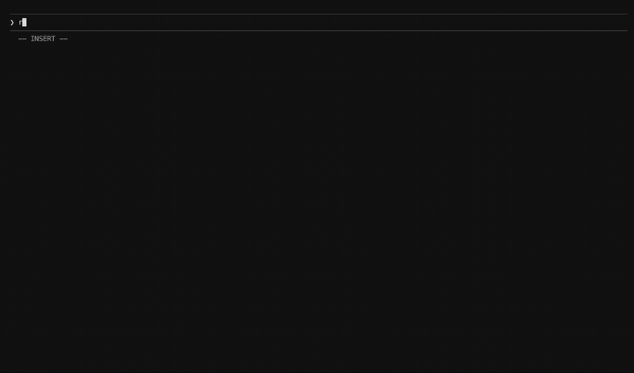
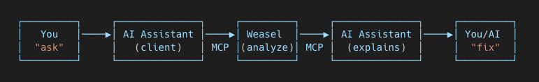

<h1 align="center">Weasel</h1>

<p align="center">
  <strong>Solidity static analyzer you can talk to</strong>
</p>

<p align="center">
  Ask your AI assistant to audit your contracts. Get explained results.
</p>

<p align="center">
  <a href="https://opensource.org/licenses/MIT"></a>
  <a href="#installation"></a>
  
</p>

<p align="center">
  
</p>

```bash
# 1. Install weasel
curl -L https://raw.githubusercontent.com/slvDev/weasel/main/weaselup/install | bash

# 2. Add to your AI tool:
# Claude Code (recommended - MCP + skills)
/plugin marketplace add slvDev/weasel
/plugin install weasel

# MCP only for Claude Code (if you don't want skills), Cursor, Windsurf
weasel mcp add
```

Now just say `weasel <command>`:

> "weasel analyze my contracts"

> "weasel poc for this reentrancy bug"

> "weasel report this finding"

> "weasel explain this function"

Weasel skills activate. Your AI runs analysis, writes PoCs, formats reports, and more.

---

## Features

- **AI-Native Skills** — 9 specialized skills for Claude Code (PoC writing, report formatting, gas optimization, and more)
- **Blazing Fast** — Parallel Rust analysis, instant MCP responses
- **MCP Server** — Works with Claude Code, Cursor, Windsurf, and any MCP-compatible tool
- **Extensive Detectors** — Vulnerabilities, gas optimizations, and code quality checks
- **Auto-Detection** — Automatically configures for Foundry, Hardhat, and Truffle projects

---

## Why Weasel?

|                    | Weasel                              | Other Analyzers              |
| ------------------ | ----------------------------------- | ---------------------------- |
| **AI Integration** | Native skills + MCP                 | Copy-paste output to ChatGPT |
| **Setup**          | `plugin install` / `mcp add`        | Manual config, scripts       |
| **Workflow**       | "weasel poc for this bug"           | Read reports, search fixes   |
| **Context**        | AI knows Solidity security patterns | Context lost between tools   |
| **Speed**          | Parallel Rust analysis              | Often single-threaded        |

---

## Installation

```bash
curl -L https://raw.githubusercontent.com/slvDev/weasel/main/weaselup/install | bash
```

Update anytime with `weaselup`.

<details>
<summary>From Source</summary>

```bash
git clone https://github.com/slvDev/weasel.git
cd weasel && cargo build --release
```

</details>

---

## Claude Code Integration

For **Claude Code** users, install the Weasel plugin for intelligent skills:

```bash
/plugin marketplace add slvDev/weasel
/plugin install weasel
```

Use `weasel` prefix to activate skills:

**Audit:**

| Skill             | What it does                                              |
| ----------------- | --------------------------------------------------------- |
| `weasel analyze`  | Security review (quick scan / manual review / full audit) |
| `weasel validate` | Verify if attack hypothesis is exploitable                |
| `weasel filter`   | Triage findings, filter false positives                   |
| `weasel poc`      | Write exploit PoC (Foundry/Hardhat)                       |
| `weasel report`   | Format findings as professional audit report              |
| `weasel overview` | Scope project, map architecture/attack surface            |

**Dev:**

| Skill             | What it does                                   |
| ----------------- | ---------------------------------------------- |
| `weasel gas`      | Find and implement gas optimizations           |
| `weasel explain`  | Explain code logic, patterns, and risks        |
| `weasel simplify` | Refactor for clarity without changing behavior |

**Skills provide context-aware expertise** — Claude knows how to analyze Solidity, write PoCs in Foundry/Hardhat, format audit reports, and more. The `weasel` prefix ensures skills only activate when you want them.

> To update the plugin, run `/plugin update weasel` in Claude Code.

---

## IDE Integration (MCP)

For **Cursor**, **Windsurf**, or Claude Code without skills:

```bash
weasel mcp add                      # auto-detect all installed IDEs
weasel mcp add --target cursor      # Cursor only
weasel mcp add --target windsurf    # Windsurf only
weasel mcp add --target claude      # Claude Code only
```

| IDE         | MCP Tools | Skills                     |
| ----------- | --------- | -------------------------- |
| Claude Code | ✅        | ✅ (via `/plugin install`) |
| Cursor      | ✅        | ❌                         |
| Windsurf    | ✅        | ❌                         |

MCP tools (`weasel_analyze`, `weasel_finding_details`, `weasel_detectors`) work in all IDEs. Skills (PoC writing, report formatting, etc.) are Claude Code exclusive.

---

## What It Detects

| Severity   | What                     | Examples                                        |
| ---------- | ------------------------ | ----------------------------------------------- |
| **High**   | Critical vulnerabilities | Reentrancy, unchecked calls, delegatecall risks |
| **Medium** | Security concerns        | Missing access control, oracle manipulation     |
| **Low**    | Best practices           | Unlocked pragma, zero-address checks            |
| **Gas**    | Optimizations            | Storage reads, loop efficiency, packing         |
| **NC**     | Code quality             | Naming, style, documentation                    |

Run `weasel detectors` to see all checks, or ask your AI: _"what can weasel detect?"_

---

## How It Works

<p align="center">
  
</p>

<p align="center">
  Your AI calls Weasel via MCP, gets structured findings, and explains them to you.
</p>

| MCP Command              | What It Does                        |
| ------------------------ | ----------------------------------- |
| `weasel_analyze`         | Scan contracts, get compact summary |
| `weasel_finding_details` | Deep dive into specific issues      |
| `weasel_detectors`       | List all available checks           |

---

## Standalone Usage

No AI? Weasel works great from the terminal.

```bash
weasel run                              # analyze ./src
weasel run -s ./contracts               # specify path
weasel run -e ./test -e ./mocks         # exclude paths
weasel run -m High                      # only critical
weasel run -o report.md                 # save report
weasel run -o report.json -f json       # JSON format
```

### Detectors

```bash
weasel detectors                # list all
weasel detectors -s High        # filter by severity
weasel detectors -d <id>        # details for one
```

### Configuration

Create `weasel.toml` with `weasel init`:

```toml
scope = ["src", "contracts"]
exclude = ["test", "script"]
min_severity = "Low"
format = "md"
remappings = ["@openzeppelin/=lib/openzeppelin-contracts/"]
```

| Option           | Short | Default           |
| ---------------- | ----- | ----------------- |
| `--scope`        | `-s`  | `["src"]`         |
| `--exclude`      | `-e`  | `["lib", "test"]` |
| `--min-severity` | `-m`  | `NC`              |
| `--format`       | `-f`  | `md`              |
| `--output`       | `-o`  | stdout            |
| `--remappings`   | `-r`  | auto              |

**Priority:** CLI flags > config file > auto-detection

---

## Project Support

**Foundry** — Remappings loaded in order:

1. Default paths (`forge-std/`, `@openzeppelin/`)
2. `remappings.txt`
3. `foundry.toml`
4. CLI `-r` flags

**Hardhat / Truffle** — Auto-detects config, uses `node_modules/`, defaults to `./contracts`

---

## FAQ

<details>
<summary><strong>AI can't find Weasel?</strong></summary>

```bash
which weasel          # should show path
weasel mcp add        # re-run setup
# restart your AI tool
```

</details>

<details>
<summary><strong>How do I check MCP config?</strong></summary>

```bash
cat ~/.claude.json              # Claude Code
cat ~/.cursor/mcp.json          # Cursor
cat ~/.codeium/windsurf/mcp_config.json  # Windsurf
```

</details>

<details>
<summary><strong>Manual MCP setup</strong></summary>

Add to your AI tool's config:

```json
{
  "mcpServers": {
    "weasel": {
      "type": "stdio",
      "command": "/path/to/weasel",
      "args": ["mcp", "serve"]
    }
  }
}
```

</details>

<details>
<summary><strong>How do I exclude test files?</strong></summary>

```bash
weasel run -e ./test -e ./src/mocks
```

</details>

<details>
<summary><strong>How do I analyze only critical issues?</strong></summary>

```bash
weasel run -m High
```

</details>

---

## License

MIT — [LICENSE.md](LICENSE.md)
